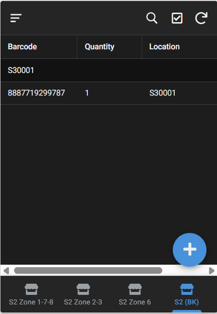
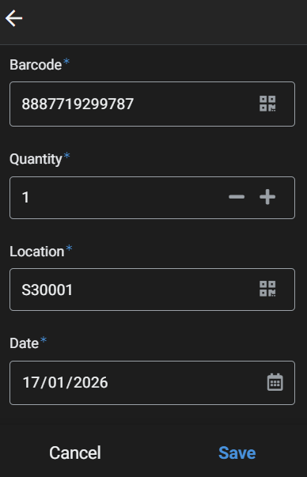

# 📦 Operational Inventory Audit App with Barcode Scanning (No-Code)

## 📌 Giới thiệu

Trong quá trình **Inventory Audit** tại cửa hàng, bộ phận Operation và Store Staff cần kiểm tra tồn kho thực tế theo **barcode sản phẩm**, **vị trí trưng bày** và **kệ hàng**.

Trước đây, việc kiểm kê thường gặp các vấn đề:
- Nhập liệu thủ công, dễ sai sót
- Không kiểm soát được việc nhập sai barcode hoặc SKU không tồn tại
- Thiếu thông tin chi tiết về vị trí (location, shelf)
- Mất thời gian xác nhận lại tên sản phẩm khi kiểm kê

Dự án này được xây dựng nhằm **chuẩn hóa và đơn giản hóa quy trình kiểm kê tồn kho**, bằng cách sử dụng **Google AppSheet (no-code)** kết hợp với **Google Sheets**.

---

## 🎯 Mục tiêu dự án

- Hỗ trợ quy trình **Inventory Audit bằng barcode**
- Chỉ cho phép nhập tồn kho với **SKU hợp lệ**
- Giúp nhân viên cửa hàng **xác nhận nhanh tên sản phẩm khi scan**
- Thu thập dữ liệu tồn kho **chi tiết theo Location & Shelf**
- Giảm thao tác thủ công, tăng tốc độ và độ chính xác khi kiểm kê

---

## 🧩 Giải pháp triển khai

### 1️⃣ Nguồn dữ liệu trung tâm (Google Sheets)
- Lưu danh sách **Barcode – Tên sản phẩm**
- Đóng vai trò là **Master Data** để kiểm soát SKU hợp lệ

### 2️⃣ App kiểm kê bằng Google AppSheet
- Nhân viên sử dụng **tính năng Scan Barcode**
- App tự động:
  - Kiểm tra barcode có tồn tại trong database hay không
  - **Chỉ cho phép nhập số lượng nếu barcode hợp lệ**
  - Hiển thị **Tên sản phẩm** dựa trên barcode đã scan

### 3️⃣ Thu thập thông tin theo vị trí thực tế
- Bổ sung các trường:
  - **Location**
  - **Shelf No.**
- Nhân viên nhập trực tiếp khi scan để đảm bảo dữ liệu chi tiết

### 4️⃣ Tối ưu trải nghiệm nhập liệu
- Sử dụng **Initial Value trong AppSheet**
- Tự động gợi ý **Shelf No. gần nhất** đã nhập trước đó
- Giảm thao tác lặp lại khi kiểm kê nhiều sản phẩm trên cùng một kệ

---

## 📊 Kết quả đạt được

- Kiểm soát 100% việc nhập tồn kho theo **SKU hợp lệ**
- Giảm sai sót do nhập nhầm barcode hoặc sản phẩm không tồn tại
- Dữ liệu tồn kho chi tiết theo **Date - Time - Store – Shelf**
- Tăng tốc độ kiểm kê và giảm áp lực cho nhân viên cửa hàng
- Dữ liệu sẵn sàng để:
  - Phân tích tồn kho
  - Đối chiếu chênh lệch
  - Phục vụ các báo cáo Inventory sau này

---

## 🛠️ Công cụ & Kỹ thuật sử dụng

- **Google AppSheet**
- **Google Sheets**
- Barcode Scanning
- Data Validation & Reference
- Initial Value Optimization
- No-Code App Development
- Process Automation

---

## 👤 Vai trò của tôi trong dự án

- Phân tích nghiệp vụ kiểm kê tồn kho
- Thiết kế data structure (barcode, product, shelf)
- Xây dựng và tối ưu AppSheet app
- Đào tạo người dùng và cải thiện trải nghiệm nhập liệu

---

> 📌 *Dự án được xây dựng nhằm giải quyết bài toán thực tế trong vận hành cửa hàng, tập trung vào tính đơn giản, chính xác và khả năng mở rộng.*

---

## 📸 Kết quả
### App View

  

### App Form

  

---

## ✉️ Tác giả
**Tram Dang Tai**  
📍 Merchandise Data Analyst  
📧 [Liên hệ qua LinkedIn](https://www.linkedin.com/in/tramdangtai)
